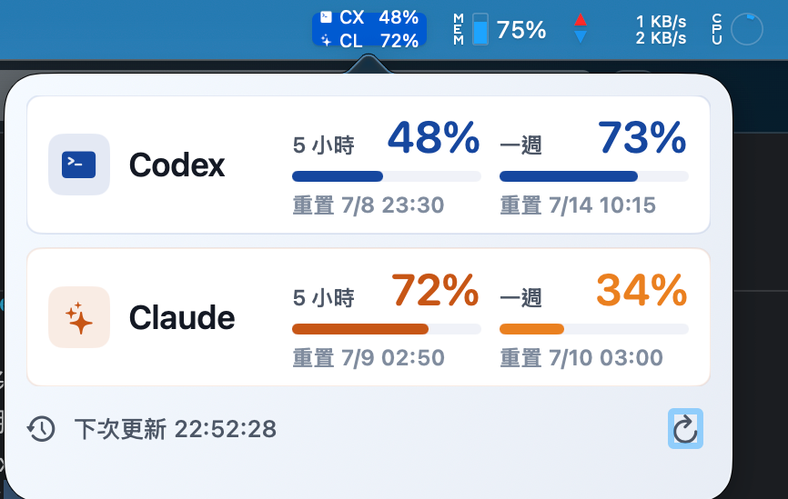

# AIBar

macOS 選單列工具，用來查看本機 Codex 與 Claude 用量。

A macOS menu bar app for checking local Codex and Claude usage.



## 顯示設定

彈出視窗提供顯示控制：

- 同時顯示 Codex 與 Claude、只顯示 Codex，或只顯示 Claude
- 同時顯示兩者時，可拖曳卡片調整 Codex / Claude 上下順序

這個設定會同時套用到選單列指示器與彈出視窗卡片。

彈出視窗底部的電源按鈕可離開 AIBar。

## 建置

```sh
scripts/build_app.sh
```

產出的 app bundle 會在：

```text
dist/AIBar.app
```

## 資料來源

- Codex：讀取 `~/.codex/sessions/**/*.jsonl` 裡的 `token_count` 事件與 rate-limit metadata。AIBar 會以 `100 - used_percent` 顯示剩餘額度。
- Claude 官方剩餘額度：讀取 `~/.ai-usage/claude-status/*.json`，這些檔案由 Claude Code `statusLine` hook 寫入。AIBar 會讀取官方的 `rate_limits.five_hour.used_percentage` 與 `rate_limits.seven_day.used_percentage`，並以 `100 - used_percentage` 顯示剩餘額度。
- Claude 本機備援：讀取 `~/.claude/projects/**/*.jsonl` 裡 assistant message 的 `usage` 欄位，並去除重複 message record。

Codex 會在本機 session logs 暴露目前 rate-limit 百分比。

Claude 本機 logs 只包含 token usage，不包含官方方案額度或重置百分比。若要準確顯示 Claude 剩餘額度，需要安裝 statusline hook。

## Claude Statusline 設定

替預設 Claude 帳號安裝 hook：

```sh
scripts/install_claude_statusline.sh
```

如果第二個 Claude 帳號使用不同 config directory：

```sh
CLAUDE_CONFIG_DIR="$HOME/.claude-work" scripts/install_claude_statusline.sh
```

如果要在選單列標示帳號名稱，啟動 Claude Code 時帶上 `AI_USAGE_CLAUDE_ACCOUNT`：

```sh
AI_USAGE_CLAUDE_ACCOUNT=個人 claude
AI_USAGE_CLAUDE_ACCOUNT=工作 CLAUDE_CONFIG_DIR="$HOME/.claude-work" claude
```

Claude Code 只會在 session 收到第一個 API response 後送出 `rate_limits`，所以新帳號卡片會在送出第一則訊息後出現。
