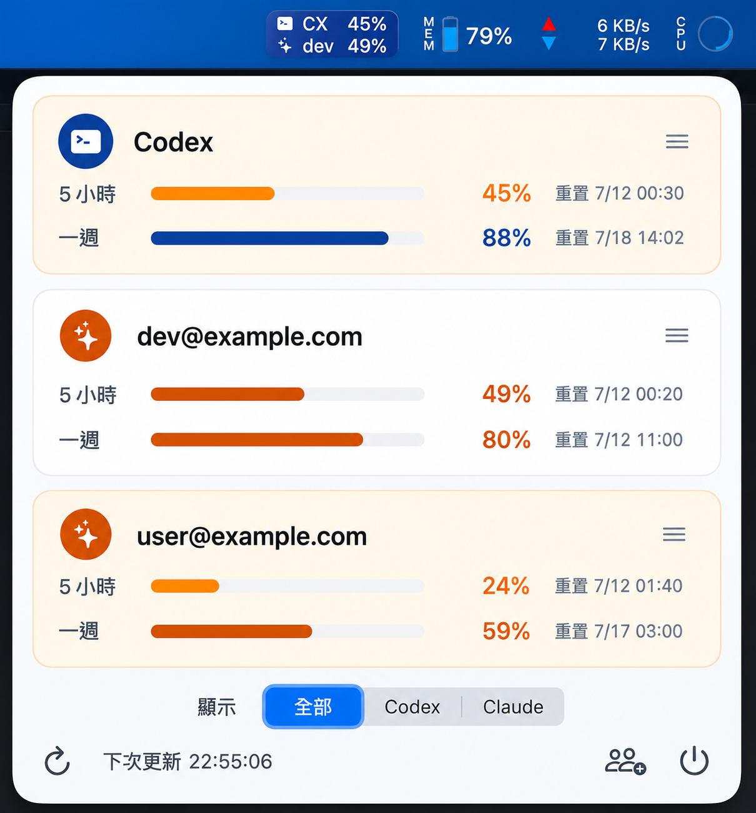
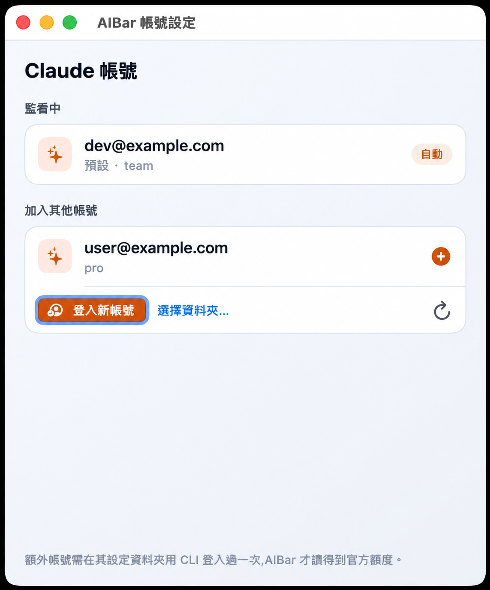

# AIBar

macOS 選單列工具，用來查看 Codex 與多個 Claude Code 帳號的剩餘額度。

A macOS menu bar app for checking local Codex usage and multiple Claude Code account quotas.

支援多個 Claude Code 帳號監看，可在選單列與彈出視窗查看各帳號剩餘額度。





## 顯示設定

彈出視窗提供顯示控制：

- 同時顯示 Codex 與 Claude、只顯示 Codex，或只顯示 Claude
- 同時顯示兩者時，可拖曳卡片調整 Codex / Claude 上下順序

這個設定會同時套用到選單列指示器與彈出視窗卡片。

彈出視窗底部的電源按鈕可離開 AIBar。

## 環境要求

- macOS 13 或更新版本
- Swift 5.9 相容工具鏈，或已安裝 Xcode Command Line Tools
- Codex CLI（`codex`），或會寫入本機 `$CODEX_HOME/sessions/**/*.jsonl` 的 Codex / ChatGPT desktop app（預設 `$CODEX_HOME` 是 `~/.codex`）
- Claude Code CLI（`claude`）、`python3`，並安裝 Claude Code statusline hook

AIBar 主要讀本機 CLI 產生的紀錄。對於你在「帳號設定」裡另外**加入監看**的 Claude 帳號，AIBar 會用該帳號在本機（macOS Keychain）儲存的 Claude Code 登入憑證，向官方查詢即時剩餘額度並在本機快取；因此該帳號需要先用 Claude Code CLI 登入過一次。未安裝 Claude statusline hook 時，AIBar 仍可讀取本機 Claude token usage，但官方 quota / 剩餘百分比會顯示未同步；只安裝 Claude Desktop 不足以提供 Claude Code 官方 quota。

## 建置

```sh
scripts/build_app.sh
```

產出的 app bundle 會在：

```text
dist/AIBar.app
```

## 資料來源

- Codex CLI / ChatGPT desktop app：讀取 `$CODEX_HOME/sessions/**/*.jsonl`（預設 `~/.codex/sessions/**/*.jsonl`）裡的 `token_count` 事件與 rate-limit metadata。AIBar 會以 `100 - used_percent` 顯示剩餘額度。
- Claude Code CLI 官方剩餘額度：讀取 `~/.ai-usage/claude-status/*.json`，這些檔案由 Claude Code `statusLine` hook 寫入。AIBar 會讀取官方的 `rate_limits.five_hour.used_percentage` 與 `rate_limits.seven_day.used_percentage`，並以 `100 - used_percentage` 顯示剩餘額度。
- Claude 本機備援：讀取 `~/.claude/projects/**/*.jsonl` 裡 assistant message 的 `usage` 欄位，並去除重複 message record。

Codex 會在本機 session logs 暴露目前 rate-limit 百分比。2026-07 起 Codex desktop 入口併入 ChatGPT desktop app，但官方 transcript 位置仍是 `$CODEX_HOME/sessions`；若使用者設定了自訂 `CODEX_HOME`，AIBar 會優先讀取該目錄並 fallback 到 `~/.codex/sessions`。

Codex quota 只會在本機 `token_count` 記錄更新後刷新；這些記錄通常在 Codex / ChatGPT 有模型回覆後才寫入。若 5 小時視窗已過重置時間但沒有新的 Codex 活動，AIBar 會保留最後一次百分比並標示待更新；Reload 只會重讀本機檔案，不會主動向雲端刷新 quota。

Claude 本機 logs 只包含 token usage，不包含官方方案額度或重置百分比。若要準確顯示 Claude 剩餘額度，需要安裝 statusline hook。

## 更新與狀態文字

- AIBar 每 60 秒自動重讀一次本機資料；打開彈出視窗或按 Reload 會立即重讀一次。
- Reload 只會重讀本機檔案，不會主動向 Codex / Claude 雲端刷新 quota；如果來源尚未寫出新快照，畫面會維持最後一次可信數字。
- `待更新` 表示重置時間已過，但本機來源尚未產生新的 rate-limit 記錄。
- `未同步` 表示尚未取得官方 quota 快照，AIBar 不會用本機 token usage 推估百分比。
- `顯示上次同步值` 表示官方查詢或憑證刷新暫時失敗，AIBar 會保留最後一次成功同步的值並在卡片標示原因。

### Claude 額度顯示說明

AIBar 只會把 Claude Code 官方回傳的額度顯示成剩餘百分比。若目前沒有可用的官方額度資料，畫面會顯示 `未同步`，不會用本機 token usage 自行推估。

一般情況下，只要 Claude Code 已安裝 statusline hook，並且該帳號有新的 Claude Code 回覆，AIBar 就能讀到最新官方額度。若 Claude Code 暫時沒有產生新快照，AIBar 會保留最後一次成功同步的數字，並在畫面上標示同步狀態。

透過「加入監看」加入的 Claude 帳號，AIBar 會使用該帳號在本機儲存的 Claude Code 登入憑證查詢官方額度。若查詢暫時失敗，AIBar 會顯示上次成功同步的值與提示，不會用其他來源補上看似精準但不可靠的百分比。

只安裝或登入 Claude Desktop 不足以提供 Claude Code 官方額度。每個要監看的帳號都需要先用 Claude Code CLI 登入過一次。

## 多帳號（Claude）

從彈出視窗右下角的人像按鈕開啟「帳號設定」來管理要監看的 Claude 帳號：

- **監看中**：你常用的預設 CLI 帳號會自動出現(標「自動」),不需手動加入。
- **加入其他帳號**：
  - AIBar 會列出這台機器上其他已登入的 Claude 帳號,按 `+` 一鍵加入。
  - **登入新帳號**：會開啟終端機帶你在瀏覽器登入一個新帳號(用獨立的設定資料夾),登入完成切回 AIBar 就會自動加入。
  - **選擇資料夾**：手動指定放在非慣例位置的 `CLAUDE_CONFIG_DIR`。

要點：

- 每個要監看的額外帳號,需先用 Claude Code CLI 在其設定資料夾登入過一次(AIBar 才讀得到憑證)。**只在 web / desktop 登入、從未用 CLI 的帳號無法取得官方額度。**
- 有兩個以上帳號時,卡片以 email 區分;只有一個帳號時顯示「Claude」。
- 選單列每個 provider 只有一行,顯示所有帳號中**最低**的剩餘 %(最快用完的那個);個別帳號的細節在彈出視窗看。
- 彈出視窗可拖曳卡片自訂順序(含 Codex 與各 Claude 帳號)。
- 監看清單存在 `~/.ai-usage/claude-accounts.json`,即時額度快取在 `~/.ai-usage/claude-cloud-cache/`。

以上是用內建 UI 管理帳號的方式。若偏好手動用 statusline hook + `CLAUDE_CONFIG_DIR`,見下節。

## Claude Statusline 設定

替預設 Claude 帳號安裝 hook：

```sh
scripts/install_claude_statusline.sh
```

如果第二個 Claude 帳號使用不同 config directory：

```sh
CLAUDE_CONFIG_DIR="$HOME/.claude-work" scripts/install_claude_statusline.sh
```

如果要在選單列標示帳號名稱，啟動 Claude Code 時帶上 `AI_USAGE_CLAUDE_ACCOUNT`：

```sh
AI_USAGE_CLAUDE_ACCOUNT=個人 claude
AI_USAGE_CLAUDE_ACCOUNT=工作 CLAUDE_CONFIG_DIR="$HOME/.claude-work" claude
```

Claude Code 只會在 session 收到第一個 API response 後送出 `rate_limits`，所以新帳號卡片會在送出第一則訊息後出現。若剛切換 Claude Code 帳號但新帳號尚未成功回覆，AIBar 會把舊 statusline 快照標成未同步，避免顯示前一個帳號的剩餘百分比。
