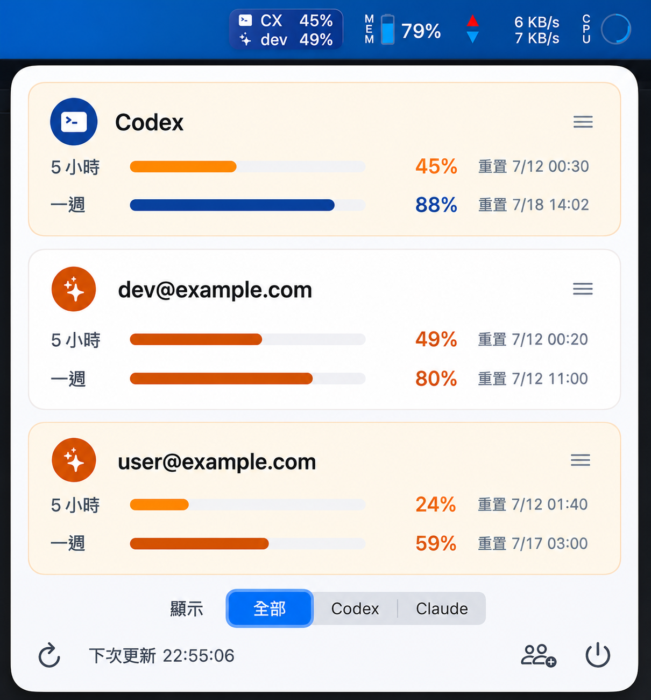
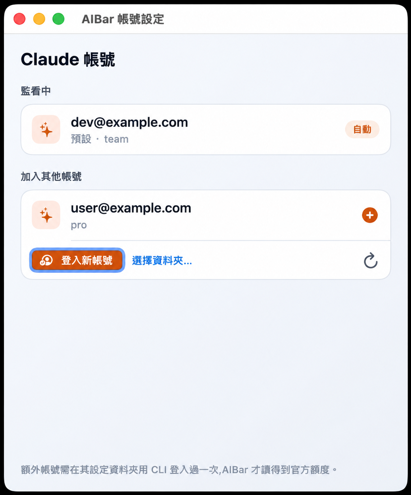

# AIBar

macOS 選單列工具，用來查看 Codex 與多個 Claude Code 帳號的剩餘額度。

A macOS menu bar app for checking local Codex usage and multiple Claude Code account quotas.

支援多個 Claude Code 帳號監看，可在選單列與彈出視窗查看各帳號剩餘額度。





## 功能重點

- 在 macOS 選單列顯示 Codex 與 Claude Code 剩餘額度
- 支援多個 Claude Code 帳號，可用 email 區分各帳號
- 可只顯示 Codex、只顯示 Claude，或同時顯示兩者
- 可拖曳卡片調整 Codex / Claude 帳號顯示順序
- 設定與快取保存在本機；額外 Claude 帳號只向 Claude 官方查詢額度

## 環境要求

- macOS 13 或更新版本
- 若要從原始碼建置：Swift 5.9 相容工具鏈，或 Xcode Command Line Tools
- Codex：Codex CLI，或會寫入本機 `$CODEX_HOME/sessions/**/*.jsonl` 的 Codex / ChatGPT desktop app
- Claude：要監看的帳號需先用 Claude Code CLI 登入過一次

只登入 Claude Desktop 不足以提供 Claude Code 官方額度；AIBar 需要讀到 Claude Code CLI 在本機儲存的登入資訊。

## 多帳號（Claude）

從彈出視窗右下角的人像按鈕開啟「帳號設定」來管理要監看的 Claude 帳號。

- **監看中**：預設 Claude Code 帳號會自動出現，標示為「自動」。
- **加入其他帳號**：AIBar 會列出這台 Mac 上其他已登入 Claude Code 的帳號，按 `+` 即可加入。
- **登入新帳號**：開啟終端機與瀏覽器，用獨立設定資料夾登入新的 Claude Code 帳號。
- **選擇資料夾**：手動指定放在非慣例位置的 `CLAUDE_CONFIG_DIR`。

有兩個以上 Claude 帳號時，卡片會以 email 區分；選單列則顯示所有帳號中最低的剩餘百分比，方便先看到最接近用完的帳號。

### 一個「帳號」其實是一個設定資料夾

AIBar 監看的單位是 `CLAUDE_CONFIG_DIR`（預設帳號是 `~/.claude`），不是帳號本身。同一個資料夾隨時可以換成另一個帳號登入，所以：

- **卡片上的 email 代表「這個資料夾現在登入的是誰」**，是每次向 Claude 官方查證得到的，不是加入當時記下來的名字。在某個資料夾重新登入別的帳號，卡片名稱會在一分鐘內自動跟著改。
- **兩個資料夾登入同一個帳號，就會出現兩張一模一樣的卡片**（數字與重置時間完全相同）。這不是故障，是那兩個資料夾真的都指向同一個帳號。
- 想確認每個資料夾目前是誰，打開「帳號設定」看各列顯示的 email 即可。

## 從原始碼建置

```sh
scripts/build_app.sh
```

產出的 app bundle 會在：

```text
dist/AIBar.app
```

## 資料來源與同步

- Codex CLI / ChatGPT desktop app：讀取 `$CODEX_HOME/sessions/**/*.jsonl`（預設 `~/.codex/sessions/**/*.jsonl`）裡的 `token_count` 事件與 rate-limit metadata。AIBar 會以 `100 - used_percent` 顯示剩餘額度。
- Claude Code 預設帳號：可透過 Claude Code `statusLine` hook 寫出的 `~/.ai-usage/claude-status/*.json` 取得官方剩餘額度。
- Claude Code 額外帳號：透過「帳號設定」加入後，AIBar 會用該帳號的 Claude Code 登入憑證向 Claude 官方查詢剩餘額度。憑證可能放在 macOS Keychain，也可能放在該設定資料夾裡的 `.credentials.json`（不同版本的 Claude Code 存放位置不同），AIBar 兩邊都會找，並以實際帶有 token 的那一份為準。若 AIBar 需要刷新 token，會寫回原本讀到的那個位置，以免 CLI 手上的憑證失效。
- Claude 本機備援：若尚未取得官方額度，AIBar 仍可讀取 `~/.claude/projects/**/*.jsonl` 裡的 token usage，但不會用它推估官方剩餘百分比。

AIBar 每 60 秒自動重讀一次本機資料；打開彈出視窗或按 Reload 會立即重讀一次。Reload 只會重讀本機資料，不會主動讓 Codex / Claude 產生新的額度快照。

## 狀態文字

- `待更新`：重置時間已過，但本機來源尚未產生新的 rate-limit 記錄。
- `未同步`：尚未取得官方額度快照；AIBar 不會用本機 token usage 推估百分比。
- `顯示上次同步值`：官方查詢或憑證刷新暫時失敗；AIBar 會保留最後一次成功同步的值並在卡片標示原因。

## Claude 額度顯示說明

AIBar 只會把 Claude Code 官方回傳的額度顯示成剩餘百分比。若目前沒有可用的官方額度資料，畫面會顯示 `未同步`。

一般情況下，只要預設 Claude Code 帳號已安裝 statusline hook，並且該帳號有新的 Claude Code 回覆，AIBar 就能讀到最新官方額度。若 Claude Code 暫時沒有產生新快照，AIBar 會保留最後一次成功同步的數字，並在畫面上標示同步狀態。

透過「加入監看」加入的 Claude 帳號，AIBar 會用該帳號的 Claude Code 登入憑證查詢官方額度。若查詢暫時失敗，AIBar 會顯示上次成功同步的值與提示，不會用其他來源補上看似精準但不可靠的百分比。

## 進階：預設帳號 statusline hook

若要讓 AIBar 自動讀取預設 Claude Code 帳號的官方額度，可安裝 statusline hook：

```sh
scripts/install_claude_statusline.sh
```

這支安裝腳本需要 `python3`。

若你用不同 `CLAUDE_CONFIG_DIR` 管理其他 Claude Code 設定資料夾，也可以手動替該資料夾安裝 hook：

```sh
CLAUDE_CONFIG_DIR="$HOME/.claude-work" scripts/install_claude_statusline.sh
```

如果要替 statusline 顯示的帳號指定名稱，啟動 Claude Code 時帶上 `AI_USAGE_CLAUDE_ACCOUNT`：

```sh
AI_USAGE_CLAUDE_ACCOUNT=個人 claude
AI_USAGE_CLAUDE_ACCOUNT=工作 CLAUDE_CONFIG_DIR="$HOME/.claude-work" claude
```

Claude Code 只會在 session 收到第一個 API response 後送出 `rate_limits`，所以安裝 hook 後需要送出一則訊息，AIBar 才會看到新的官方額度快照。

## 疑難排解

**兩張卡片顯示同一個 email、數字也一模一樣**

兩個設定資料夾登入了同一個帳號。這不是顯示錯誤。用下面這段可以看到每個資料夾目前登入誰：

```sh
python3 - <<'EOF'
import json, os, glob
home = os.path.expanduser('~')
dirs = [None] + sorted(d for d in glob.glob(home+'/.claude*') if os.path.isdir(d) and d != home+'/.claude')
for d in dirs:
    cfg  = home+'/.claude.json' if d is None else d+'/.claude.json'
    name = '~/.claude (預設)' if d is None else d.replace(home, '~')
    try: email = json.load(open(cfg))['oauthAccount']['emailAddress']
    except Exception: email = '(沒有登入紀錄)'
    print(f'{name:24} {email}')
EOF
```

要讓某個資料夾換回另一個帳號，在該資料夾重新登入即可，AIBar 會自動跟上：

```sh
CLAUDE_CONFIG_DIR="$HOME/.claude-account" claude /login
```

**卡片名稱跟你記得的帳號不一樣**

那個設定資料夾被重新登入成別的帳號了。卡片顯示的是該資料夾**現在**的帳號，以官方查證為準。

**帳號從「帳號設定」清單消失，或額度停在某個時間點不再更新**

該資料夾的憑證讀不到了。常見原因是 Claude Code 換了憑證存放位置、或該帳號已登出。在該資料夾重新登入一次即可：

```sh
claude /login                                        # 預設帳號
CLAUDE_CONFIG_DIR="$HOME/.claude-account" claude /login   # 其他資料夾
```
