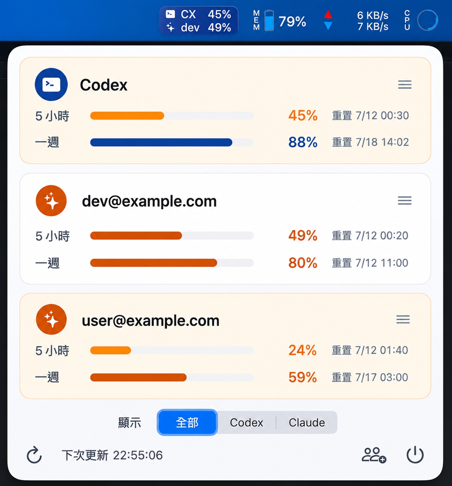
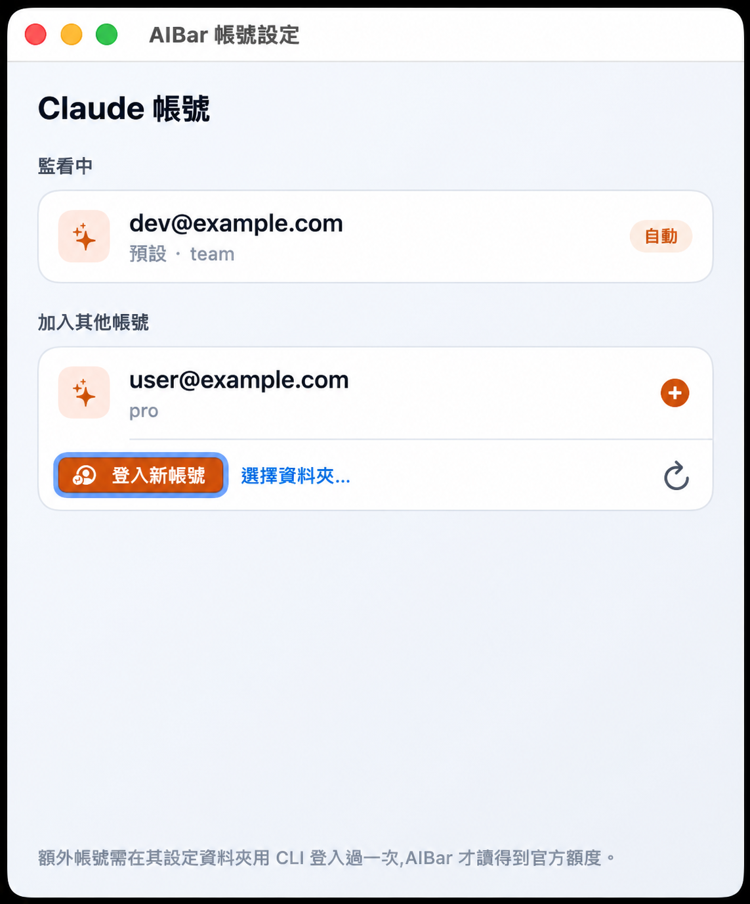

# AIBar

macOS 選單列工具，用來查看 Codex 與多個 Claude Code 帳號的剩餘額度。

A macOS menu bar app for checking local Codex usage and multiple Claude Code account quotas.

支援多個 Claude Code 帳號監看，可在選單列與彈出視窗查看各帳號剩餘額度。





## 功能重點

- 在 macOS 選單列顯示 Codex 與 Claude Code 剩餘額度
- 支援多個 Claude Code 帳號，可用 email 區分各帳號
- 可只顯示 Codex、只顯示 Claude，或同時顯示兩者
- 可拖曳卡片調整 Codex / Claude 帳號顯示順序
- 設定與快取保存在本機；額外 Claude 帳號只向 Claude 官方查詢額度

## 環境要求

- macOS 13 或更新版本
- 若要從原始碼建置：Swift 5.9 相容工具鏈，或 Xcode Command Line Tools
- Codex：沿用這台 Mac 上 Codex 已儲存的 ChatGPT 登入快取，不需要在 AIBar 重新登入；只有 session 紀錄而沒有有效登入快取時，無法取得即時額度
- Claude：要監看的帳號需先用 Claude Code CLI 登入過一次

只登入 Claude Desktop 不足以提供 Claude Code 官方額度；AIBar 需要讀到 Claude Code CLI 在本機儲存的登入資訊。

## 多帳號（Claude）

從彈出視窗右下角的人像按鈕開啟「帳號設定」來管理要監看的 Claude 帳號。

- **監看中**：預設 Claude Code 帳號會自動出現，標示為「自動」。
- **加入其他帳號**：AIBar 會列出這台 Mac 上其他已登入 Claude Code 的帳號，按 `+` 即可加入。
- **登入新帳號**：開啟終端機與瀏覽器，用獨立設定資料夾登入新的 Claude Code 帳號。
- **選擇資料夾**：手動指定放在非慣例位置的 `CLAUDE_CONFIG_DIR`。

有兩個以上 Claude 帳號時，卡片會以 email 區分。選單列依目前的顯示模式與卡片順序，最多顯示前兩項；拖曳卡片即可調整哪些項目出現在選單列。各項優先顯示尚未過期的主要額度視窗，若無可用的主要視窗則顯示次要視窗（Claude 通常分別為 5 小時與一週）；沒有可用額度時顯示 `--`。

### 一個「帳號」其實是一個設定資料夾

AIBar 監看的單位是 `CLAUDE_CONFIG_DIR`（預設帳號是 `~/.claude`），不是帳號本身。同一個資料夾隨時可以換成另一個帳號登入，所以：

- **透過官方查詢的卡片會以目前登入者的 email 命名**。身分查證結果會快取一小時；登入憑證改變時會重新查證。若暫時無法查證，可能沿用上次已知的 email 或加入時儲存的名稱，因此名稱未更新時應一併確認同步狀態。
- **兩個資料夾登入同一個帳號，會出現兩張代表同一帳號的卡片**。各資料夾的快取時間可能不同，數字不一定同時更新。
- 打開「帳號設定」可查看各列的 email 與設定資料夾名稱；將滑鼠停在該列可查看完整路徑。

## 從原始碼建置

```sh
git clone https://github.com/neo-wabow/AIBar.git
cd AIBar
scripts/build_app.sh
open dist/AIBar.app
```

產出的 app bundle 會在：

```text
dist/AIBar.app
```

一般建置使用臨時簽章，只供本機測試。公開發佈時必須使用 Apple Developer ID Application 憑證簽章，並完成 notarization；設定 `AI_BAR_RELEASE=1` 與 `AI_BAR_CODESIGN_IDENTITY` 才能進行發佈建置。建置腳本會拒絕沒有 Developer ID 的發佈模式。臨時簽章的測試包不應作為公開下載版本。

Codex 查詢的離線回歸檢查可執行 `scripts/test_codex.sh`，使用假的登入資料，不讀取真實憑證也不連線。

## 資料來源與同步

- Codex CLI / ChatGPT desktop app：優先透過本機 Codex app-server 讀取目前登入帳號的即時額度。AIBar 會搜尋 app bundle、`~/.local/bin/codex`、Homebrew 常見位置與 `PATH`。若即時查詢不可用，才讀取 `$CODEX_HOME/sessions/**/*.jsonl`（預設 `~/.codex/sessions/**/*.jsonl`）裡的 rate-limit metadata；快照超過 15 分鐘便顯示 `未同步`，避免把舊百分比當成目前額度。剩餘額度以 `100 - used_percent` 計算。
- 找不到 Codex 執行檔或 app-server 查詢不可用時，AIBar 會沿用 `$CODEX_HOME/auth.json`（預設 `~/.codex/auth.json`）或 Codex 的 macOS Keychain 登入快取，直接向 ChatGPT 查詢額度。這不需要安裝 CLI、不會開啟登入流程，也不會產生模型回覆。登入快取的來源依照 Codex 的 `cli_auth_credentials_store` 設定選擇；明確設定的 `CODEX_HOME` 不會被其他帳號的資料夾取代。
- Claude Code 預設帳號：可透過 Claude Code `statusLine` hook 寫出的 `~/.ai-usage/claude-status/*.json` 取得官方剩餘額度。
- Claude Code 額外帳號：透過「帳號設定」加入後，AIBar 會用該帳號的 Claude Code 登入憑證向 Claude 官方查詢剩餘額度。憑證可能放在 macOS Keychain，也可能放在該設定資料夾裡的 `.credentials.json`（不同版本的 Claude Code 存放位置不同），AIBar 兩邊都會找，並以實際帶有 token 的那一份為準。若 AIBar 需要刷新 token，會寫回原本讀到的那個位置，以免 CLI 手上的憑證失效。
- Claude 本機備援：若尚未取得官方額度，AIBar 仍可讀取 `~/.claude/projects/**/*.jsonl` 裡的 token usage，但不會用它推估官方剩餘百分比。

AIBar 每 60 秒自動刷新；打開彈出視窗或按 Reload 也會觸發刷新。Claude 官方額度查詢會沿用 120 秒內的快取，收到 HTTP 429 限流且已有快取時會暫停查詢 5 分鐘，因此刷新介面不一定會送出新的官方請求。Codex 即時查詢不會產生模型回覆或消耗額度；Claude 的 statusline 與本機 token 紀錄仍需要新的 CLI 回覆才會產生快照。

## 狀態文字

- `待更新`：重置時間已過，尚未取得新的有效額度視窗。
- `未同步`：尚未取得官方額度快照；AIBar 不會用本機 token usage 推估百分比。
- `顯示上次同步值`：官方查詢或憑證刷新暫時失敗；AIBar 會保留最後一次成功同步的值並在卡片標示原因。
- `登入已過期，請重新登入`：Claude 的登入已無法刷新；卡片會提供「重新登入」按鈕，開啟終端機與瀏覽器，讓你在原設定資料夾恢復登入。

若 Codex 顯示 `未同步`，點卡片上的狀態圖示可區分登入快取讀不到、授權暫時失效、連線失敗或官方限流。直接查詢只讀取既有憑證；憑證刷新仍交由 Codex 管理，AIBar 不會更動登入檔案。未取得即時額度且本機快照超過 15 分鐘時，會顯示最後更新時間並停止顯示舊百分比。

此備援使用 Codex 官方原始碼中的[額度查詢端點](https://github.com/openai/codex/blob/main/codex-rs/backend-client/src/client/rate_limit_resets.rs)與[登入快取格式](https://github.com/openai/codex/blob/main/codex-rs/login/src/auth/storage.rs)。自訂後端、僅 API key、記憶體登入及新的加密 secrets 儲存格式仍交由本機 Codex app-server 處理。

## Claude 額度顯示說明

AIBar 只會把 Claude Code 官方回傳的額度顯示成剩餘百分比。若目前沒有可用的官方額度資料，畫面會顯示 `未同步`。

一般情況下，只要預設 Claude Code 帳號已安裝 statusline hook，並且該帳號有新的 Claude Code 回覆，AIBar 就能讀到最新官方額度。若 Claude Code 暫時沒有產生新快照，AIBar 會保留最後一次成功同步的數字，並在畫面上標示同步狀態。

透過「加入監看」加入的 Claude 帳號，AIBar 會用該帳號的 Claude Code 登入憑證查詢官方額度。若查詢暫時失敗，AIBar 會顯示上次成功同步的值與提示，不會用其他來源補上看似精準但不可靠的百分比。

## 進階：預設帳號 statusline hook

若要讓 AIBar 自動讀取預設 Claude Code 帳號的官方額度，可安裝 statusline hook：

```sh
scripts/install_claude_statusline.sh
```

這支安裝腳本需要 `python3`。

若你用不同 `CLAUDE_CONFIG_DIR` 管理其他 Claude Code 設定資料夾，也可以手動替該資料夾安裝 hook：

```sh
CLAUDE_CONFIG_DIR="$HOME/.claude-work" scripts/install_claude_statusline.sh
```

如果要替 statusline 顯示的帳號指定名稱，啟動 Claude Code 時帶上 `AI_USAGE_CLAUDE_ACCOUNT`：

```sh
AI_USAGE_CLAUDE_ACCOUNT=個人 claude
AI_USAGE_CLAUDE_ACCOUNT=工作 CLAUDE_CONFIG_DIR="$HOME/.claude-work" claude
```

Claude Code 只會在 session 收到第一個 API response 後送出 `rate_limits`，所以安裝 hook 後需要送出一則訊息，AIBar 才會看到新的官方額度快照。

## 疑難排解

### Claude 卡片顯示「登入已過期，請重新登入」

按卡片上的「重新登入」，在開啟的瀏覽器確認使用的是這張卡片對應的帳號。登入完成後關閉終端機視窗、切回 AIBar，等下一次刷新或按 Reload。

AIBar 會在原設定資料夾重新登入；已知 email 時也會帶入登入指令。仍請確認瀏覽器選到的帳號，避免把同一個資料夾換成別人的登入。

若要手動登入，先從「帳號設定」確認資料夾路徑，再執行對應指令：

```sh
# 預設帳號：請在未設定 CLAUDE_CONFIG_DIR 的終端機執行
env -u CLAUDE_CONFIG_DIR claude auth login --claudeai

# 其他帳號：將路徑與 email 換成要恢復的帳號
CLAUDE_CONFIG_DIR="$HOME/.claude-work" claude auth login --claudeai --email 'you@example.com'
```

預設帳號請保持 `CLAUDE_CONFIG_DIR` 未設定；即使指定為 `~/.claude`，CLI 也可能使用不同的 Keychain 項目。

### Claude 額度沒有立刻更新，或顯示「顯示上次同步值」

先點卡片上的 `i` 狀態圖示查看原因，再依狀態處理：

- **剛按 Reload，但數字沒變**：官方查詢使用 120 秒快取；額度本身也可能沒有變化。等快取到期後再查看。
- **官方 API 暫時限流**：已有快取時會保留上次同步值並暫停查詢 5 分鐘，等 AIBar 自動重試即可。
- **連線或刷新暫時失敗**：確認網路連線，恢復後再按 Reload。若出現「登入已過期」，按該卡片的「重新登入」；若狀態持續指出授權失效，可用上方指令恢復該資料夾的登入。
- **預設帳號使用 statusline 來源**：確認已安裝 hook，並在 Claude Code CLI 送出一則訊息；只有 web / desktop 活動不會更新本機 statusline 快照。

### Claude 帳號沒有出現在清單，或提示找不到有效憑證

先開啟「帳號設定」並按「重新掃描」。非慣例位置的設定資料夾可用「選擇資料夾…」加入；已設定的額外帳號即使暫時無法讀取憑證，也會保留在「監看中」。

AIBar 會同時檢查 macOS Keychain 與該設定資料夾的 `.credentials.json`。若仍找不到有效登入，請確認資料夾存在，並用上方對應的指令在該資料夾重新登入。只登入 Claude Desktop 無法提供 AIBar 所需的 CLI 登入資訊。

### 兩張 Claude 卡片顯示同一個 email

打開「帳號設定」，查看兩列各自對應的資料夾；將滑鼠停在該列可查看完整路徑。兩個資料夾可能登入了同一個帳號，額度也就屬於同一份配額。

若只需要監看一次，移除重複的額外資料夾即可；「移除」只取消 AIBar 監看，不會刪除資料夾或登出 Claude Code。若原本應是不同帳號，請在要更換的資料夾重新登入，並確認瀏覽器選到正確帳號。

### Claude 卡片名稱跟預期不同

先確認「帳號設定」中的資料夾路徑，並查看卡片同步狀態。資料夾可能已登入另一個帳號；身分查證暫時失敗時，也可能顯示上次已知的名稱。不要只憑名稱判定登入被換掉。

登入憑證改變後，AIBar 會在後續刷新重新向官方查證身分；查證成功後會更新 email。額度另有 120 秒快取，換帳號後的第一輪刷新仍可能顯示上一份額度快照。

### Codex 顯示「未同步」

點卡片上的 `i` 狀態圖示，查看是登入快取讀不到、授權失效、連線失敗或官方限流。登入問題請回到 Codex app 或 CLI 恢復登入，再切回 AIBar 按 Reload；網路或限流問題則等連線恢復或稍後重試。

AIBar 會先查詢本機 Codex app-server，不可用時再沿用既有登入快取直接查詢額度。兩者都失敗時，只會顯示 15 分鐘內的本機 session 快照；更舊的快照會停止顯示百分比，並在狀態說明列出最後更新時間。

### 多個帳號都有卡片，但選單列只顯示兩項

選單列最多顯示目前模式下排序最前面的兩項。拖曳卡片調整順序，或切換「全部 / Codex / Claude」，即可選擇要優先看到的項目；其餘帳號仍可在彈出視窗查看。
